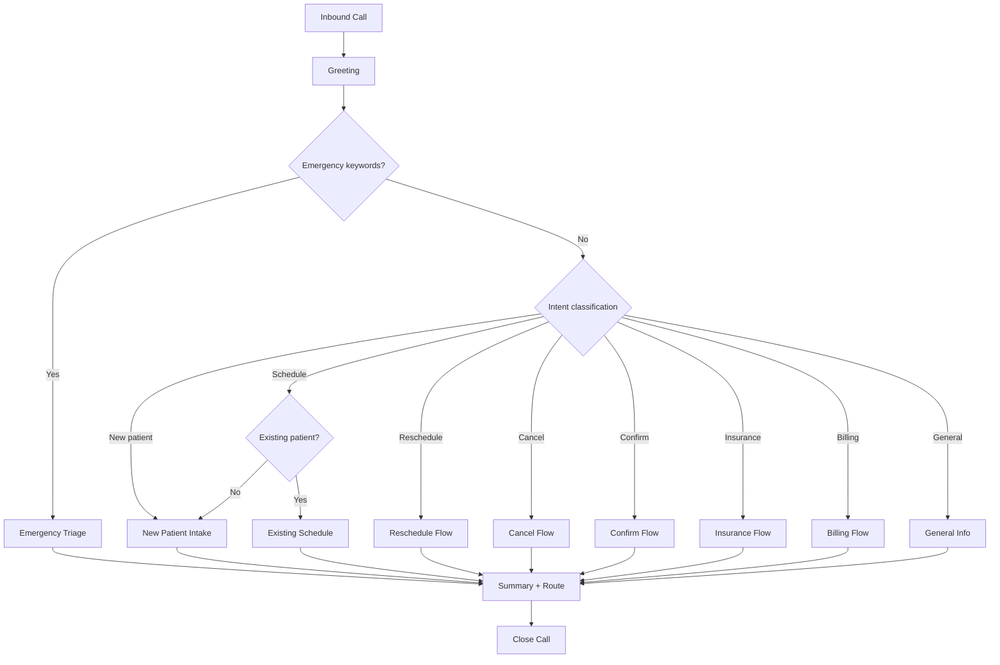

# Call Flows

> **Purpose:** Canonical phone conversation design for FreedomDesk — scripts, decision trees, triage rules, slot collection schemas, and summary output formats. Optimized for **West Michigan independent general dentistry** (Grand Rapids profile). Voice engineers, prompt engineers, and dental consultants use this document as the source of truth for call behavior.

**Regional defaults:** Delta Dental PPO clarification, Healthy Kids Dental / Michigan Medicaid taxonomy, Open Dental appointment types, same-day emergency flagging. See [DENTAL_WORKFLOWS.md](DENTAL_WORKFLOWS.md) for operational context.

---

## Table of Contents

1. [Call Flow Architecture](#call-flow-architecture)
2. [Universal Call Structure](#universal-call-structure)
3. [Greeting and Intent Classification](#greeting-and-intent-classification)
4. [New Patient Call Flow](#new-patient-call-flow)
5. [Existing Patient — Schedule Appointment](#existing-patient--schedule-appointment)
6. [Existing Patient — Reschedule](#existing-patient--reschedule)
7. [Existing Patient — Cancel](#existing-patient--cancel)
8. [Existing Patient — Confirm](#existing-patient--confirm)
9. [Treatment-Specific Scheduling Calls](#treatment-specific-scheduling-calls)
10. [Pediatric Scheduling Call Flow](#pediatric-scheduling-call-flow)
11. [Same-Day Emergency Call Flow](#same-day-emergency-call-flow)
12. [Emergency and Urgent Call Flow](#emergency-and-urgent-call-flow)
13. [After-Hours Call Flow](#after-hours-call-flow)
14. [Insurance Questions — West Michigan](#insurance-questions--west-michigan)
15. [Demographics and Insurance Update](#demographics-and-insurance-update)
16. [Waitlist Request Call Flow](#waitlist-request-call-flow)
17. [Billing Questions Call Flow](#billing-questions-call-flow)
18. [General Information Call Flow](#general-information-call-flow)
19. [Wrong Number / Non-Dental Call Flow](#wrong-number--non-dental-call-flow)
20. [Summary Schemas](#summary-schemas)
21. [Decision Trees](#decision-trees)
22. [Error and Edge Case Handling](#error-and-edge-case-handling)

---

## Call Flow Architecture

Every FreedomDesk call follows a layered architecture:

```
Layer 1: GREETING          — Practice name, agent name, offer to help
Layer 2: CLASSIFICATION    — Intent detection within 30 seconds
Layer 3: EXECUTION         — State machine for intent (collect slots)
Layer 4: CONFIRMATION      — Read back key details
Layer 5: CLOSE             — Next steps, thank caller
Layer 6: SUMMARY           — Structured output generation
```

The LLM handles natural language within each layer. The state machine controls layer transitions and required data collection. **The state machine is authoritative** — the LLM cannot skip required fields or bypass triage.

---

## Universal Call Structure

### Opening (all calls)

```
AGENT: "Thank you for calling [Practice Name]. [This is Aly.] How can I help you today?"
```

Variations (configured per practice):

| Context | Greeting modifier |
|---------|-------------------|
| Business hours | Standard greeting |
| After hours | "...You've reached our after-hours line. This is Aly. How can I help you?" |
| Holiday | "...We're closed today for [holiday]. This is our after-hours line..." |
| Custom name | "...This is [Configured Name]..." (FreedomDesk Custom) |

### Closing (all calls)

```
AGENT: "[Confirmation of next step]. [Thank you message]. Have a [wonderful/great] day."
```

Examples:
- "You're all set for Thursday at 9 AM. We look forward to seeing you, [Name]. Have a wonderful day."
- "Someone from our team will call you back shortly. Hang in there, [Name]. Have a good evening."

### Universal rules

| Rule | Detail |
|------|--------|
| **Max monologue** | 2 sentences before pausing for caller response |
| **Name usage** | Use caller name 2–3 times per call, naturally |
| **Hold language** | "One moment while I pull that up" (never silent >5 seconds without acknowledgment) |
| **Transfer language** | Only if practice configures live transfer; otherwise "I'll make sure our team gets this right away" |
| **AI disclosure** | Never identify as AI, bot, or virtual assistant |
| **Clinical advice** | Never diagnose, prescribe, or guarantee treatment/insurance outcomes |

---

## Greeting and Intent Classification

### Intent categories

| Intent | Trigger phrases | Route to |
|--------|----------------|----------|
| `NEW_PATIENT` | "New patient," "first visit," "never been there," "just moved," "looking for a dentist" | New Patient Flow |
| `SCHEDULE_EXISTING` | "Schedule a cleaning," "make an appointment," "crown seat," "need to come in" | Existing Patient Schedule or Treatment-Specific |
| `TREATMENT_SCHEDULE` | "Crown seat," "root canal," "extraction," "implant consult," "denture fitting," "fillings" | Treatment-Specific Scheduling |
| `PEDIATRIC` | "Schedule my son/daughter," child age mentioned | Pediatric Scheduling |
| `WAITLIST` | "Waitlist," "earlier opening," "sooner appointment" | Waitlist Flow |
| `DEMOGRAPHICS_UPDATE` | "Update my address," "new insurance," "new phone number" | Demographics Update |
| `RESCHEDULE` | "Move my appointment," "change my appointment," "different time" | Reschedule Flow |
| `CANCEL` | "Cancel my appointment," "can't make it" | Cancel Flow |
| `CONFIRM` | "Confirm my appointment," "calling about my appointment on [date]" | Confirm Flow |
| `EMERGENCY` | "Toothache," "broken tooth," "pain," "swelling," "bleeding," "knocked out," "emergency" | Emergency Triage |
| `INSURANCE` | "Do you accept," "in network," "insurance question" | Insurance Flow |
| `BILLING` | "Bill," "balance," "payment," "statement," "charge" | Billing Flow |
| `GENERAL_INFO` | "Hours," "directions," "where are you located," "services" | General Info Flow |
| `PRESCRIPTION` | "Refill," "prescription," "medication" | Route to dentist (no prescribing) |
| `COMPLAINT` | "Complaint," "unhappy," "problem with" | Empathize + route to office manager |
| `OTHER` | Unclassified | Clarifying question, then route |

### Classification decision tree

```
"How can I help you today?"
         │
         ├── Mentions pain/emergency/trauma ──────────▶ EMERGENCY (immediate triage)
         │
         ├── "New patient" / "first time" / "new to area" ─▶ NEW_PATIENT
         │
         ├── "Schedule" / "appointment" / "cleaning"
         │       │
         │       └── "Are you a current patient with us?"
         │               ├── YES ──▶ SCHEDULE_EXISTING
         │               └── NO  ──▶ NEW_PATIENT
         │
         ├── "Reschedule" / "change" / "move" ────────▶ RESCHEDULE
         ├── "Cancel" ─────────────────────────────────▶ CANCEL
         ├── "Confirm" ────────────────────────────────▶ CONFIRM
         ├── Insurance keywords ───────────────────────▶ INSURANCE
         ├── Billing keywords ─────────────────────────▶ BILLING
         └── General info ─────────────────────────────▶ GENERAL_INFO
```

### Clarifying question (when intent unclear)

```
AGENT: "I'd be happy to help. Are you a current patient with us, or would this be your first visit?"
```

---

## New Patient Call Flow

### Demo reference

See `audio/New Patient/New Patient.flac` and `scripts/generate_demo_audio.py` scenario `new-patient-exam`.

### State machine

```
GREET → NEW_PATIENT_INTake
  │
  ├── COLLECT_NAME
  ├── COLLECT_PHONE
  ├── COLLECT_DOB (optional Phase 1, required Phase 2)
  ├── COLLECT_INSURANCE
  ├── COLLECT_CHIEF_COMPLAINT
  ├── COLLECT_REFERRAL_SOURCE (optional)
  ├── OFFER_APPOINTMENT
  ├── CONFIRM_APPOINTMENT
  └── CLOSE
```

### Full script

```
AGENT: "Thank you for calling [Practice Name]. This is Aly. How can I help you today?"

CALLER: "Hi, I'd like to schedule a new patient exam. I just moved to the area."

AGENT: "We'd love to welcome you. Have you been to our office before?"

CALLER: "No, this would be my first visit."

AGENT: "Perfect. Can I start with your full name?"

CALLER: "[Full Name]"

AGENT: "Thanks, [First Name]. And what's the best phone number to reach you?"

CALLER: "[Phone]"

AGENT: "Great. Do you have dental insurance you'd like us to have on file before your visit?"

CALLER: "[Yes — carrier / No]"

IF YES:
  AGENT: "Perfect. If you have your member ID handy, I can note that too — otherwise, just bring your card to the visit."

AGENT: "For a new patient exam, we set aside about [60 minutes / an hour]. I have [Day] at [Time] or [Day] at [Time] — would either work?"

CALLER: "[Selection]"

AGENT: "You're all set for [Day] at [Time]. We'll send a confirmation text, and if you could arrive about 15 minutes early for your paperwork, that would be great."

CALLER: "Sounds good. Thank you."

AGENT: "We're looking forward to meeting you, [First Name]. Have a wonderful day."
```

### Required summary fields

```json
{
  "intent": "NEW_PATIENT",
  "urgency": "routine",
  "caller": {
    "name": "Finn Leo",
    "phone": "+16165550142",
    "isNewPatient": true,
    "dateOfBirth": null
  },
  "insurance": {
    "carrier": "Delta Dental",
    "planType": "PPO | Medicaid | HKD | Michigan_Medicaid | PPO_Other | none",
    "memberId": "string | null",
    "medicaidId": "string | null"
  },
  "chiefComplaint": "New patient exam — new to area",
  "referralSource": null,
  "appointment": {
    "type": "New Patient Exam",
    "scheduledSlot": "2026-07-03T09:00:00",
    "preferredTimes": ["Thursday 9 AM"]
  }
}
```

---

## Existing Patient — Schedule Appointment

### State machine

```
GREET → IDENTIFY_PATIENT → DETERMINE_NEED → OFFER_SLOTS → CONFIRM → CLOSE
```

### Script

```
AGENT: "Thank you for calling [Practice Name]. This is Aly. How can I help you today?"

CALLER: "I need to schedule a cleaning."

AGENT: "Of course. Can I get your full name and date of birth so I can pull up your chart?"

CALLER: "[Name], [DOB]"

[PMS LOOKUP — if available]
  ├── Found → "Hi [First Name], I have your chart here."
  └── Not found → "I'm not finding a record under that name. Could you double-check the spelling, or are you perhaps a new patient?"

AGENT: "When was your last cleaning with us?" (if PMS recall unavailable)

AGENT: "I have [Day/Time options]. Would any of these work?"

CALLER: "[Selection]"

AGENT: "You're booked for [Day] at [Time] with [Provider/Hygienist]. We'll send a reminder text. Anything else I can help with?"

AGENT: "Great. See you then, [First Name]. Have a wonderful day."
```

### Appointment type routing

| Caller request | Appointment type | Duration |
|---------------|------------------|----------|
| "Cleaning" / "checkup" | Prophy + periodic exam | 60 min |
| "Cleaning and exam" | Prophy + periodic exam | 60 min |
| "Just a cleaning" | Prophy only | 45–60 min |
| "Filling" / "crown" / treatment | Restorative (from treatment plan) | Per config |
| "Emergency" / "tooth pain" | Emergency flow | See emergency section |

---

## Existing Patient — Reschedule

### Script

```
AGENT: "I can help with that. Can I get your name and date of birth?"

CALLER: "[Name], [DOB]"

AGENT: "I see you have an appointment on [Day] at [Time]. Is that the one you'd like to move?"

CALLER: "Yes."

AGENT: "No problem. I have [new options]. Would either work?"

CALLER: "[Selection]"

AGENT: "Done — I've moved your appointment to [Day] at [Time]. Our cancellation policy is [24/48] hours notice, so just keep that in mind for future changes. See you then!"
```

### Late cancellation flag

If appointment is within practice's cancellation window:

```
AGENT: "I can move that for you. Just so you know, our office policy is [24/48] hours notice for changes. I'll note this for the team."
```

Summary includes: `"lateCancellation": true`

---

## Existing Patient — Cancel

### Script

```
AGENT: "Can I get your name and date of birth?"

[PMS LOOKUP — find appointment]

AGENT: "I see your appointment on [Day] at [Time]. Would you like to cancel that?"

CALLER: "Yes."

AGENT: "I've noted that cancellation. Would you like to reschedule now, or should we follow up later?"

IF RESCHEDULE → Reschedule flow
IF LATER → "No problem. Give us a call when you're ready to rebook. Take care, [Name]."
```

### Summary flag

Always include cancellation reason if provided. Flag late cancellations.

---

## Existing Patient — Confirm

### Script

```
AGENT: "Can I get your name and date of birth?"

AGENT: "I see your appointment on [Day] at [Time] with [Provider]. You're all confirmed. Please arrive [X] minutes early. See you then!"
```

If PMS integration available: mark appointment confirmed.

---

## Treatment-Specific Scheduling Calls

When caller mentions a specific treatment, classify to `TREATMENT_SCHEDULE` and set `appointment.type` precisely — the front desk should not re-classify.

### Crown seat

```
CALLER: "I need to schedule my crown."

AGENT: "Of course. Can I get your name and date of birth?"
AGENT: "Which tooth is the crown for, if you remember?"
AGENT: "Do you still have the temporary on?"
[Offer crown seat slots — 30–40 min doctor block]
AGENT: "You're set for [Day] at [Time] for your crown seat with Dr. [Name]."
```

Summary: `{ "appointment": { "type": "Crown Seat", "tooth": "#14", "provider": "Dr. Smith" } }`

### Root canal (in-house or referral)

```
CALLER: "I need to schedule a root canal."

AGENT: "I can help with that. Name and date of birth?"
AGENT: "Which tooth is that for?"
AGENT: "Are you having pain with it now?"
IF pain → escalate urgency / same-day path
IF practice refers out:
  AGENT: "Dr. [Name] may refer some root canals to a specialist. I'll note your information and our team will call you with next steps."
ELSE:
  [Offer RCT appointment slot]
```

### Extraction

```
AGENT: "Was this already recommended by Dr. [Name], or is this a new concern?"
IF new pain → triage for same-day emergency
ELSE:
  [Schedule extraction per configured duration]
AGENT: "Are you on any blood thinners?" → collect yes/no only; flag for clinical review
```

### Implant consultation

```
AGENT: "I'll schedule you for an implant consultation. Can I get your name and date of birth?"
AGENT: "Is this for a missing tooth or a tooth that needs to come out?"
[Offer consult slot — 30–45 min]
```

### Denture (identify stage)

```
AGENT: "I'd be happy to help. Is this for new dentures, a adjustment, a repair, or a fitting?"
Map to: consult | impression | try-in | delivery | reline | adjustment
[Schedule per stage duration]
```

---

## Pediatric Scheduling Call Flow

```
AGENT: "I'd be happy to help. Is this for your child?"

CALLER: "Yes, my daughter needs a cleaning."

AGENT: "What's her name and date of birth?"
AGENT: "And your name as the parent or guardian?"

[Insurance — prioritize HKD/Michigan Medicaid taxonomy]
AGENT: "Does she have dental insurance — like Healthy Kids Dental or Delta Dental?"

[Schedule child prophy + exam — 30–45 min hygiene block]
AGENT: "We have [slot]. We'd ask that a parent come with her. Would that work?"
```

Summary includes: `patientIsMinor: true`, `guardianName`, `insurance.program: "HKD" | ...`

---

## Same-Day Emergency Call Flow

During **business hours** when caller needs to be seen today:

```
[After triage classifies URGENT/EMERGENCY]

AGENT: "I'm sorry you're dealing with that. Let me see what we have available today."
IF slot available:
  AGENT: "We can see you today at [Time]. Can I get your name and date of birth?"
  [Collect demographics if new patient]
  AGENT: "We'll expect you at [Time]. Please arrive a few minutes early."
IF no slot:
  AGENT: "I'm flagging this as urgent for our team — someone will call you back within [X] minutes to work you in."
```

Summary: `{ "sameDayEmergency": true, "urgency": "urgent", "symptoms": [...] }`

---

## Emergency and Urgent Call Flow

### Demo references

- `audio/Weekend Toothache/Toothache.mp3` — after-hours toothache
- `audio/Broken Tooth/Broken-Tooth.mp3` — broken tooth trauma

### State machine

```
GREET → TRIAGE_SYMPTOMS → CLASSIFY_URGENCY → COLLECT_INFO → ROUTE → CLOSE
```

### Triage script (toothache example)

```
AGENT: "Thank you for calling [Practice Name]. [After-hours line.] This is Aly. How can I help you?"

CALLER: "I've had a really bad toothache since last night and it's getting worse."

AGENT: "I'm so sorry you're dealing with that. Are you having any swelling or fever with the pain?"

CALLER: "[Response]"

AGENT: "When did this start?"

CALLER: "[Response]"

AGENT: "Is the pain constant, or does it come and go?"

CALLER: "[Response]"

[CLASSIFY URGENCY based on responses — see decision tree below]

IF URGENT/EMERGENCY:
  AGENT: "Okay, thank you for letting me know. I'm going to flag this as urgent for our on-call team right away."
  AGENT: "Can I get the best phone number to reach you in case we get disconnected?"
  CALLER: "[Phone]"
  AGENT: "Got it. Someone from our team will call you back as soon as possible. If the pain becomes severe, you develop swelling or a fever, please seek urgent care or your dentist's emergency line right away."

IF PRIORITY (non-urgent):
  AGENT: "That sounds uncomfortable. Let me find the next available appointment for you."
  → Offer emergency/exam slot

AGENT: "Hang in there, [Name]. [We'll be in touch soon. / See you on Day.]"
```

### Triage script (broken tooth example)

```
CALLER: "I broke a tooth eating something hard."

AGENT: "I'm sorry that happened. Is the tooth causing you any pain right now?"

CALLER: "[Yes/No]"

AGENT: "Is there any bleeding?"

CALLER: "[Response]"

IF PAIN + BROKEN:
  → URGENT: Flag for same-day/next-day; on-call callback if after hours

IF NO PAIN + BROKEN:
  → PRIORITY: Schedule next available (1–3 days)

AGENT: "Can I get your name and the best number to reach you?"
[Collect info, route per urgency]
```

### Urgency classification decision tree

```
Symptoms reported
       │
       ├── Fever + facial swelling ──────────────▶ EMERGENCY → on-call NOW + ER guidance
       ├── Uncontrolled bleeding ──────────────▶ EMERGENCY → on-call NOW + ER guidance
       ├── Knocked-out permanent tooth ────────▶ EMERGENCY → on-call NOW (<60 min window)
       ├── Jaw locked / can't open/close ─────▶ EMERGENCY → ER or oral surgeon
       │
       ├── Severe pain (7+/10) ────────────────▶ URGENT → on-call callback / same-day slot
       ├── Pain + swelling (no fever) ─────────▶ URGENT
       ├── Broken tooth WITH pain ─────────────▶ URGENT
       ├── Post-extraction bleeding (controlled) ▶ URGENT
       ├── Lost crown WITH pain ───────────────▶ URGENT
       │
       ├── Mild-moderate pain ─────────────────▶ PRIORITY → next available slot
       ├── Broken tooth NO pain ───────────────▶ PRIORITY
       ├── Lost filling/crown NO pain ─────────▶ PRIORITY
       ├── Broken denture ─────────────────────▶ PRIORITY or ROUTINE
       │
       └── No pain, cosmetic concern ──────────▶ ROUTINE → regular scheduling
```

### Emergency summary schema

```json
{
  "intent": "EMERGENCY",
  "urgency": "urgent",
  "caller": {
    "name": "Finn Leo",
    "phone": "+16165550198",
    "isNewPatient": false
  },
  "emergency": {
    "symptoms": ["sharp pain", "lower left"],
    "swelling": false,
    "fever": false,
    "trauma": false,
    "painLevel": "severe",
    "duration": "since last night, worsening",
    "routingAction": "on_call_callback"
  },
  "actionItems": [
    {
      "type": "on_call_callback",
      "assignee": "on_call_dentist",
      "priority": "urgent",
      "notes": "Sharp lower left pain since last night, worsening. No swelling or fever."
    }
  ]
}
```

---

## After-Hours Call Flow

After-hours calls use the same intent classification but with modified routing:

| Intent | After-hours behavior |
|--------|---------------------|
| Emergency/Urgent | On-call protocol — callback within configured timeframe |
| New patient | Collect intake; create appointment request for next business day confirmation |
| Schedule existing | Collect preferred times; appointment request (not confirmed until office opens) |
| Reschedule/Cancel | Collect details; task for front desk next business day |
| Billing/Insurance | Take message; callback next business day |
| General info | Answer if in config (hours, address, directions); otherwise take message |

### After-hours greeting

```
AGENT: "Thank you for calling [Practice Name]. You've reached our after-hours line. This is Aly. How can I help you?"
```

### Setting expectations

For non-emergency after-hours calls:

```
AGENT: "Our office is currently closed, but I can collect your information and our team will confirm your appointment when we open [Day] at [Time]."
```

---

## Insurance Questions — West Michigan

### Delta Dental disambiguation (required)

When caller says "Delta" or "Delta Dental":

```
AGENT: "Is that Delta Dental through your employer, or state insurance like Medicaid or Healthy Kids Dental?"
  ├── Employer / work → delta_dental_ppo
  ├── Medicaid / state → delta_dental_medicaid
  └── Child / Healthy Kids → healthy_kids_dental
```

### Script

```
CALLER: "Do you take Delta Dental?"

AGENT: [Check practice config]
IF in-network PPO:
  "Yes, we're in-network with Delta Dental. Would you like to schedule an appointment?"
  [Clarify PPO vs Medicaid if not yet known]

IF HKD / Medicaid:
  [Only if practice accepts]
  "Yes, we see Healthy Kids Dental patients. I'll need your child's name, date of birth, and Medicaid ID if you have it."

IF NOT accepted:
  "We're not in-network with that plan, but we can see you as out-of-network or self-pay. Our team can explain options at your visit."
```

### Never say

- "Your procedure will be covered"
- "You're in-network" without confirming plan type (PPO vs Medicaid)
- Specific dollar amounts or remaining benefits

---

## Demographics and Insurance Update

```
CALLER: "I need to update my insurance / phone number / address."

AGENT: "I can help with that. Can I get your name and date of birth to pull up your chart?"

IF insurance change:
  [Run West Michigan insurance taxonomy intake]
  AGENT: "Please bring your new card to your next visit. Our team will verify benefits."

IF contact update:
  AGENT: "What's the new [phone / address / email]?"
  AGENT: "Got it — I've noted that for our team to update."

Summary: intent DEMOGRAPHICS_UPDATE with updates object
```

---

## Waitlist Request Call Flow

```
CALLER: "I'm on the waitlist — do you have anything sooner?" / "Can you put me on the waitlist?"

AGENT: "Can I get your name and date of birth?"
AGENT: "What type of appointment are you waiting for — a cleaning, crown, or something else?"
AGENT: "Do you have flexibility — any day, or mornings only?"

IF checking for opening:
  AGENT: "I don't see an earlier opening right now, but I've noted your request. Our team will call if something opens up."

Summary: { "waitlist": true, "appointmentType": "Prophy", "flexibility": "mornings only" }
```

---

## Billing Questions Call Flow

### Script

```
CALLER: "What's my balance?" / "I have a question about my bill."

AGENT: "I'll make sure our billing team gets your question. Can I get your name and the best number to call you back?"

CALLER: "[Name, Phone]"

AGENT: "And can you briefly describe what you're calling about?"

CALLER: "[Description]"

AGENT: "Got it. Someone from our billing team will call you back during business hours. Is there anything else I can help with today?"
```

Summary routes to billing with `actionItems: [{ type: "billing_callback", ... }]`

---

## General Information Call Flow

### Configurable answers (from practice config)

| Question | Source |
|----------|--------|
| Office hours | `practice_configs.hours_of_operation` |
| Address / directions | `practice_configs.address` |
| Phone / fax | `practice_configs.phone` |
| Services offered | `practice_configs.services[]` |
| Providers | `practice_configs.providers[]` |
| Parking | `practice_configs.parking_notes` |
| Website | `practice_configs.website` |

### Script

```
CALLER: "What are your hours?"

AGENT: "We're open [hours from config]. Is there anything else I can help with?"
```

---

## Wrong Number / Non-Dental Call Flow

```
AGENT: "Thank you for calling [Practice Name]. This is Aly. How can I help you?"

CALLER: [Clearly wrong number / vendor / spam]

AGENT: "I think you may have the wrong number — this is [Practice Name], a dental office. Is there anything else I can help with?"

IF VENDOR/SALES:
  "We're not interested at this time. Have a good day." → END CALL
```

Do not engage with sales calls. Log as `intent: OTHER, outcome: wrong_number`.

---

## Summary Schemas

### Base schema (all calls)

```json
{
  "$schema": "https://freedomdesk.com/schemas/call-summary/v1",
  "id": "uuid",
  "practiceId": "uuid",
  "callId": "uuid",
  "timestamp": "ISO-8601",
  "durationSeconds": 120,
  "intent": "NEW_PATIENT | SCHEDULE_EXISTING | TREATMENT_SCHEDULE | PEDIATRIC | RESCHEDULE | CANCEL | CONFIRM | EMERGENCY | SAME_DAY_EMERGENCY | INSURANCE | DEMOGRAPHICS_UPDATE | WAITLIST | BILLING | GENERAL_INFO | OTHER",
  "urgency": "routine | urgent | emergency",
  "caller": {
    "name": "string",
    "phone": "E.164",
    "isNewPatient": "boolean",
    "dateOfBirth": "YYYY-MM-DD | null",
    "email": "string | null",
    "pmsPatientId": "string | null"
  },
  "actionItems": [
    {
      "type": "schedule_appointment | on_call_callback | billing_callback | general_callback | confirm_appointment | cancel_appointment | reschedule_appointment",
      "assignee": "front_desk | on_call_dentist | billing | office_manager",
      "priority": "routine | urgent | emergency",
      "notes": "string"
    }
  ],
  "deliveryStatus": "pending | delivered | failed"
}
```

### Intent-specific extensions

Each intent adds fields to the base schema. See individual flow sections above for examples.

### Summary delivery format (email)

```
Subject: [FreedomDesk] New Patient Call — Finn Leo — Jul 3 at 9 AM

━━━━━━━━━━━━━━━━━━━━━━━━━━━━━━
FREEDOMDESK CALL SUMMARY
━━━━━━━━━━━━━━━━━━━━━━━━━━━━━━

Type:        New Patient Exam
Urgency:     Routine
Duration:    2m 50s
Time:        Thu Jun 30, 2026 2:15 PM EST

CALLER
  Name:      Finn Leo
  Phone:     (616) 555-0142
  New Patient: Yes

INSURANCE
  Carrier:   Delta Dental PPO

APPOINTMENT
  Type:      New Patient Exam (60 min)
  Scheduled: Thu Jul 3, 2026 at 9:00 AM
  Status:    Request (pending office confirmation)

ACTION NEEDED
  □ Confirm appointment in PMS
  □ Send new patient forms
  □ Verify insurance

━━━━━━━━━━━━━━━━━━━━━━━━━━━━━━
```

---

## Decision Trees

### Master call routing



---

## Error and Edge Case Handling

| Scenario | Handling |
|----------|----------|
| **Caller can't hear agent** | "Can you hear me okay? ... I'll speak a bit louder." |
| **Caller speaks another language** | "I'm sorry, I can only assist in English. I'll have someone from our team call you back who can help." → Summary with language note |
| **Caller is angry/upset** | Empathize first: "I understand that's frustrating." Do not argue. Route to office manager. |
| **Caller asks "Are you a robot?"** | "I'm here to help you with scheduling and questions for [Practice Name]. What can I help you with?" |
| **PMS lookup fails** | "I'm having a little trouble pulling up your chart. Can I get your information and have our team call you back to confirm?" |
| **No available slots** | "Our next available [appointment type] is [date]. I can also note your preferred times and have our team follow up." |
| **Caller hangs up mid-call** | Generate partial summary with collected fields; flag as incomplete |
| **Multiple callers on line** | Handle one at a time; if call waiting, finish current call before next |
| **Child calling for parent** | Collect parent/guardian name and info; note "caller is minor/guardian" |
| **HIPAA: third party calling** | "I can take a message, but I'll need to speak with [Patient Name] directly for appointment details." |

---

## Related Documents

- [DENTAL_WORKFLOWS.md](DENTAL_WORKFLOWS.md) — operational context for call flows
- [FREEDOMDESK_CONTEXT.md](FREEDOMDESK_CONTEXT.md) — voice persona and product principles
- [PRACTICE_MANAGEMENT_SOFTWARE.md](PRACTICE_MANAGEMENT_SOFTWARE.md) — PMS integration during calls
- [ARCHITECTURE.md](ARCHITECTURE.md) — summary service and conversation engine
- `voice/persona.json` — Aly persona definition
